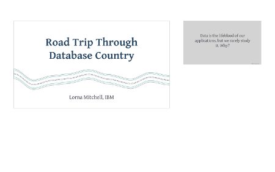

# Welcome to rst2pdf

The `rst2pdf` tool creates PDF documents from your ReStructured Text markup.  It is an Open Source, free-to-use tool that will help you create documents, slide decks and other PDF output very quickly and easily.

## Why rst2pdf?

**Simple and quick to create**  Open your preferred text editor, capture your thoughts, and generate to a professional-looking document.

**Separate content and presentation** Slide deck needs to be higher contrast?  Apply a different style and re-generate.  Updated branding? Create one new style and apply to all PDFs.

**Source Control** Collaborate easily with others or simply keep easy track of your own work as you go.

**Open Source** Free to use and free to change - the tool, the styles you use, it's all yours!

## Quick Links for the Impatient

* The fine [manual]({{ site.base_url }}/static/manual.html) ([PDF]({{ site.base_url }}/static/manual.pdf))
* [github project](https://github.com/rst2pdf/rst2pdf)
* [some examples](/examples)

## Getting Started

To create your first PDF, simply install the `rst2pdf` tool, write some text, and create the first document.

### Install rst2pdf

`rst2pdf` requires Python 3.6 or greater.

**Option 1: install with pip**

This is the easiest option and will give the most recent stable release.

```
sudo pip install rst2pdf
```

**Option 2: install from source**

Choose this option if you want the newest features, or to contribute to the project.

```
git clone https://github.com/rst2pdf/rst2pdf
cd rst2pdf
sudo python setup.py install
```

Note that you may need to use `sudo python3 setup.py install` depending on your configuration.

### Start using rst2pdf

Start with a text file.  `rst2pdf` uses [ReStructured Text](http://docutils.sourceforge.net/rst.html) which is a markup format similar to (but a bit more detailed than) markdown.  Here's an example file to get you started:

```
PDF Documents From Your Text Editor
###################################

This tool uses a plain text format for content, then applies styles to make the nice document you see here.

Lorem ipsum dolor sit amet, consectetur adipiscing elit. Aliquam maximus tortor sem, vel pellentesque leo fringilla et. Aliquam imperdiet nisi eget dui finibus sagittis. Nunc malesuada libero vel dignissim pharetra. Cras egestas vehicula quam, et accumsan arcu lacinia auctor. Integer imperdiet sagittis justo, vel varius nulla dapibus finibus. Cras rhoncus mattis pellentesque. Quisque vel sapien sed tellus convallis accumsan. Praesent volutpat sapien at lacinia scelerisque. Phasellus neque libero, consectetur in neque id, egestas elementum nisl.

Mauris eu dolor non massa auctor suscipit. Donec sit amet aliquet eros, id sodales leo. Duis erat ipsum, laoreet eget nulla at, euismod ullamcorper mi. Curabitur vel orci a libero ullamcorper finibus. Sed vel lectus sapien. Praesent mollis et dui at laoreet. Donec eleifend, nunc nec bibendum luctus, massa lorem vestibulum justo, a convallis nunc turpis ut urna. Proin venenatis erat et ante convallis efficitur. Lorem ipsum dolor sit amet, consectetur adipiscing elit. In neque turpis, sollicitudin maximus egestas sed, finibus a odio. Nam eu eros id enim vehicula hendrerit at vel orci. Curabitur volutpat tempor purus ut auctor. Mauris vulputate sollicitudin porttitor. Nunc consectetur lectus nibh, et commodo purus porttitor ut. Nulla facilisi.

Further Sections, Headings, etc
===============================

Sed id interdum quam. Donec suscipit, justo ac blandit vestibulum, massa est semper dolor, vel sodales nulla metus eu purus. In risus tortor, interdum pellentesque dolor a, rhoncus volutpat orci. Ut commodo purus orci, non aliquet massa maximus in. Morbi semper dui ipsum, a dictum nisi pretium ut. Vestibulum bibendum lacinia viverra. In hac habitasse platea dictumst. Nunc vestibulum maximus mollis. Cras suscipit dictum condimentum. Nam vulputate, enim at gravida placerat, tellus nibh accumsan ligula, auctor ornare purus leo ac orci. Quisque ultricies dictum purus. In facilisis feugiat suscipit.
```

Save this file as `sample.rst` and generate PDF with this command:

```
rst2pdf sample.rst
```

Check for a new file called `sample.pdf` - and you are already on your `rst2pdf` journey!

## Tips, Tricks and Tools

There are a few other PDF tools that we use and love, they are included here in case you need them too!

### Tools we use While Building

**nodemon** <https://nodemon.io>

Useful for watching for changed files and then automatically recompiling a PDF. For example:

    nodemon --watch input.rst --watch *.style --exec rst2pdf input.rst

### Working with PDF Files

**pdftk: The PDF Toolkit** [https://www.pdflabs.com/tools/pdftk-the-pdf-toolkit/](https://www.pdflabs.com/tools/pdftk-the-pdf-toolkit/)

This commandline tool allows you to combine PDFs (useful for adding coversheets), extract and change metadata such as bookmarks, and much more.

**pdfjam** [https://warwick.ac.uk/fac/sci/statistics/staff/academic-research/firth/software/pdfjam/](https://warwick.ac.uk/fac/sci/statistics/staff/academic-research/firth/software/pdfjam/)

Very useful for resizing and scaling PDFs, and printing handouts with multiple slides per page.

Try the example below for 12 slides per page, A4 landscape (also ideal for checking that the fonts are large enough, you should be able to read this when printed ...)

```
pdfjam --suffix handout --nup '4x3' --frame 'true' --noautoscale 'false' --delta '0.2cm 2cm' --scale '0.9' --landscape -- ${FILE}.pdf -
```

**Imagemagick** [https://www.imagemagick.org](https://www.imagemagick.org)

Can treat PDFs as images, very useful for creating previews, thumbnails, or tweetable versions of slides ...

### Presenting with PDF

**PDF Presenter Console** [https://pdfpc.github.io/](https://pdfpc.github.io/)


Available for most Linux flavours (on Ubuntu, `apt-get install pdf-presenter-console`) and is also open source so you can patch if required.

**Presentation.app** [http://iihm.imag.fr/blanch/software/osx-presentation/](http://iihm.imag.fr/blanch/software/osx-presentation/)



For OSX, this is a great Keynote-alternative for presenter view and notes.

