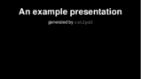
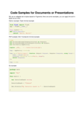

rst2pdf Examples
================

Here are a few examples of the kinds of things that rst2pdf can do,
along with the source and style files so that you can use them as
starting points for your own projects. You are very welcome to suggest
additional examples by opening an issue on `our source
repo <https://github.com/rst2pdf/rst2pdf.github.io>`__ and to add your
own examples - follow the ``CONTRIBUTING.md`` file for more information.

Basic Document
--------------

.. image:: examples/document1/document1-thumbnail.png

A simple document with some headings and the basic rst2pdf styling.

-  **PDF:** :download:`document1.pdf <examples/document1/document1.pdf>`
-  **Content:** :download:`document1.rst <examples/document1/document1.rst>`
-  **Style:** (no style applied)
-  **Command:** ``rst2pdf document1.rst``

Document with Simple Styling
----------------------------

The same basic document with some styles added.

-  **PDF:** :download:`document1-simple.pdf <examples/document1/document1-simple.pdf>`
-  **Content:** :download:`document1.rst <examples/document1/document1.rst>`
-  **Style:** :download:`simple.style <examples/document1/simple.style>`
-  **Command:** ``rst2pdf --stylesheets=simple.style document1.rst document1-simple.pdf``

Basic Presentation: Dark and Light Themes
-----------------------------------------

Here is a simple sample presentation (inspired by
https://github.com/akrabat/rst2pdf_example_presentation), with both dark
and light styles. These could be a starting point for your own
presentations.

-  **PDF:** :download:`presentation1-light.pdf <examples/presentation1/presentation1-light.pdf>`
   and
   :download:`presentation1-dark.pdf <examples/presentation1/presentation1-dark.pdf>`
-  **Content:**
   :download:`presentation1.rst <examples/presentation1/presentation1.rst>`
-  **Style:** :download:`light.style <examples/presentation1/light.style>`
   and :download:`dark.style <examples/presentation1/dark.style>` (tip: the
   dark one also uses the built-in ``fruity`` stylesheet for code samples)
-  **Command (light):**
   ``rst2pdf -s light.style -b1 presentation1.rst -o presentation1-light.pdf``
-  **Command (dark):**
   ``rst2pdf -s dark.style,fruity -b1 presentation1.rst -o presentation1-dark.pdf``

Code Samples
------------

A document with a few code samples (pull requests to expand the set are
very welcome) to show how to use the syntax highlight. You can use any
of the built in styles or create your own!

-  **PDF:** :download:`code1.pdf <examples/code1/code1.pdf>`
-  **Content:** :download:`code1.rst <examples/code1/code1.rst>`
-  **Command:** ``rst2pdf code1.rst`` ... try using some of the built in
   stylesheets such as ``murphy``, ``solarized-light`` or ``xcode`` to
   change the way the code looks.

..

   Tip: to set the background, use the ``backColor`` directive in the
   ``code`` section of your style file.

Structured Document
-------------------

.. image:: examples/structured-document/structured-document-thumbnail.png

This document has automatically numbered headings and a generated table
of contents. These are ReStructuredText Directives, more info in the
docs for that here:
https://docutils.sourceforge.io/docs/ref/rst/directives.html#document-parts

-  **PDF:**
   :download:`structured-document.pdf <examples/structured-document/structured-document.pdf>`
-  **Content:**
   :download:`structured-document.rst <examples/structured-document/structured-document.rst>`
-  **Command:** ``rst2pdf structured-document.rst``
